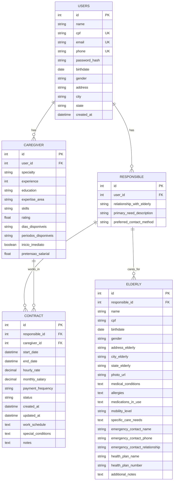

# Relatório Técnico Completo - ProjectCare

## Sumário Executivo

O **ProjectCare** é uma aplicação web Flask desenvolvida para conectar cuidadores a responsáveis por idosos, funcionando como uma plataforma de marketplace para cuidados geriátricos. O sistema utiliza um banco de dados relacional com 4 entidades principais e implementa autenticação baseada em sessão com múltiplos perfis de usuário.

---

## 1. Estrutura de Diretórios

```
ProjectCare/
├── app/                          # Aplicação principal Flask
│   ├── __init__.py              # Factory pattern e configuração da app
│   ├── run.py                   # Entry point da aplicação
│   ├── models/                  # Modelos de dados (SQLAlchemy)
│   │   ├── user.py             # Usuário base (autenticação)
│   │   ├── caregiver.py        # Perfil de cuidador
│   │   ├── responsible.py      # Perfil de responsável
│   │   ├── elderly.py          # Dados do idoso
│   │   └── contract.py         # Contratos entre partes
│   ├── routes/                 # Rotas e controladores
│   │   ├── home.py            # Página inicial
│   │   ├── login.py           # Autenticação
│   │   ├── register.py        # Cadastro
│   │   ├── caregivers.py      # Listagem de cuidadores
│   │   └── responsible_dashboard.py  # Dashboard do responsável
│   ├── services/              # Camada de serviços (business logic)
│   │   ├── user_service.py
│   │   ├── authentication_service.py
│   │   ├── caregiver_service.py
│   │   ├── responsible_service.py
│   │   └── elderly_service.py
│   ├── templates/            # Templates Jinja2
│   └── static/              # Arquivos estáticos (CSS, JS, imagens)
├── migrations/              # Migrações do banco (Alembic)
├── requirements.txt        # Dependências Python
└── vercel.json            # Configuração de deploy
```

---

## 2. Arquitetura do Banco de Dados

### 2.1. Modelo Entidade-Relacionamento

O sistema utiliza **4 entidades principais** com relacionamentos bem definidos:



### 2.2. Relacionamentos Detalhados

1. **User (1:N) Caregiver**: Um usuário pode ter apenas um perfil de cuidador
2. **User (1:N) Responsible**: Um usuário pode ter apenas um perfil de responsável
3. **Responsible (1:N) Elderly**: Um responsável pode cuidar de múltiplos idosos
4. **Responsible (1:N) Contract**: Um responsável pode ter múltiplos contratos
5. **Caregiver (1:N) Contract**: Um cuidador pode ter múltiplos contratos

### 2.3. Constraints e Validações

- **Unicidade**: CPF, email e telefone são únicos na tabela `users`
- **Integridade Referencial**: Todas as FKs têm CASCADE configurado
- **Validações**: 
  - Senhas hasheadas com Argon2
  - Datas de nascimento obrigatórias
  - Status de contrato controlado ('active', 'completed', 'cancelled')

---

## 3. Análise Detalhada dos Modelos

### 3.1. User Model (`app/models/user.py`)

**Função**: Modelo base para autenticação e dados pessoais comuns.

```python
class User(db.Model):
    __tablename__ = "users"
    
    # Campos de identificação
    id = db.Column(db.Integer, primary_key=True)
    name = db.Column(db.String(100), nullable=False)
    cpf = db.Column(db.String(17), unique=True, nullable=False)
    email = db.Column(db.String(100), unique=True, nullable=False)
    phone = db.Column(db.String(20), unique=True, nullable=False)
    
    # Segurança
    password_hash = db.Column(db.String(200), nullable=False)
    
    # Dados pessoais
    gender = db.Column(db.String(20), nullable=False)
    birthdate = db.Column(db.Date, nullable=False)
    address = db.Column(db.String(255), nullable=False)
    city = db.Column(db.String(100), nullable=False)
    state = db.Column(db.String(100), nullable=False)
    
    # Auditoria
    created_at = db.Column(db.DateTime, default=datetime.utcnow)
```

**Características Especiais**:
- **Hash de senha**: Utiliza Argon2 com configuração robusta de segurança
- **Relacionamentos opcionais**: Um User pode ter 0, 1 ou 2 perfis (Caregiver + Responsible)
- **Validação de unicidade**: CPF, email e telefone não podem ser duplicados

### 3.2. Caregiver Model (`app/models/caregiver.py`)

**Função**: Armazena dados específicos do profissional cuidador.

```python
class Caregiver(db.Model):
    __tablename__ = "caregiver"
    
    # Qualificações profissionais
    specialty = db.Column(db.String(100), nullable=False)
    experience = db.Column(db.Integer, nullable=False)  # anos
    education = db.Column(db.String(100), nullable=False)
    expertise_area = db.Column(db.String(100), nullable=False)
    skills = db.Column(db.String(500), nullable=False)
    rating = db.Column(db.Float, nullable=False, default=0.0)
    
    # Disponibilidade e condições
    dias_disponiveis = db.Column(db.String(100), nullable=True)
    periodos_disponiveis = db.Column(db.String(100), nullable=True)
    inicio_imediato = db.Column(db.Boolean, nullable=True)
    pretensao_salarial = db.Column(db.Float, nullable=True)
```

**Evolução**: Campo `skills` foi aumentado de 200 para 500 caracteres (migração `88e77b6b2ef9`).

### 3.3. Responsible Model (`app/models/responsible.py`)

**Função**: Representa pessoas responsáveis por idosos.

```python
class Responsible(db.Model):
    __tablename__ = "responsible"
    
    # Contexto do cuidado
    relationship_with_elderly = db.Column(db.String(50), nullable=True)
    primary_need_description = db.Column(db.String(255), nullable=True)
    preferred_contact_method = db.Column(db.String(30), nullable=True)
```

**Design Pattern**: Modelo simples focado em dados contextuais do relacionamento com o idoso.

### 3.4. Elderly Model (`app/models/elderly.py`)

**Função**: Armazena dados completos do idoso que receberá cuidados.

```python
class Elderly(db.Model):
    __tablename__ = "elderly"
    
    # Identificação básica
    name = db.Column(db.String(100), nullable=False)
    cpf = db.Column(db.String(20), nullable=True)  # Opcional
    birthdate = db.Column(db.Date, nullable=False)
    gender = db.Column(db.String(10), nullable=False)
    
    # Localização
    address_elderly = db.Column(db.String(255), nullable=True)
    city_elderly = db.Column(db.String(100), nullable=True)
    state_elderly = db.Column(db.String(100), nullable=True)
    
    # Informações médicas
    medical_conditions = db.Column(db.Text, nullable=True)
    allergies = db.Column(db.Text, nullable=True)
    medications_in_use = db.Column(db.Text, nullable=True)
    mobility_level = db.Column(db.String(40), nullable=True)
    specific_care_needs = db.Column(db.Text, nullable=True)
    
    # Contatos de emergência
    emergency_contact_name = db.Column(db.String(100), nullable=True)
    emergency_contact_phone = db.Column(db.String(30), nullable=True)
    emergency_contact_relationship = db.Column(db.String(50), nullable=True)
    
    # Plano de saúde
    health_plan_name = db.Column(db.String(100), nullable=True)
    health_plan_number = db.Column(db.String(50), nullable=True)
```

**Observação Importante**: Este modelo **não herda** de User - são entidades independentes ligadas por FK.

### 3.5. Contract Model (`app/models/contract.py`)

**Função**: Formaliza acordos entre Responsible e Caregiver.

```python
class Contract(db.Model):
    __tablename__ = "contract"
    
    # Período do contrato
    start_date = db.Column(db.DateTime, nullable=False)
    end_date = db.Column(db.DateTime, nullable=False)
    
    # Informações financeiras
    hourly_rate = db.Column(db.Numeric(10, 2), nullable=True)
    monthly_salary = db.Column(db.Numeric(10, 2), nullable=True)
    payment_frequency = db.Column(db.String(20), nullable=True)  # semanal, quinzenal, mensal
    
    # Controle de status
    status = db.Column(db.String(20), default='active', nullable=False)
    
    # Auditoria
    created_at = db.Column(db.DateTime, default=datetime.utcnow, nullable=False)
    updated_at = db.Column(db.DateTime, default=datetime.utcnow, onupdate=datetime.utcnow)
    
    # Detalhes do acordo
    work_schedule = db.Column(db.Text, nullable=True)
    special_conditions = db.Column(db.Text, nullable=True)
    notes = db.Column(db.Text, nullable=True)
```

**Evolução**: Campos financeiros e de controle foram adicionados na migração `f825fafcaa0c`.

---

## 4. Camada de Serviços (Business Logic)

### 4.1. Padrão Arquitetural

O sistema implementa o padrão **Service Layer**, separando a lógica de negócio dos controladores:

```python
# Exemplo: UserService
class UserService:
    @staticmethod
    def validate_user_creation(user: User) -> UserValidationResult:
        """Centraliza validações de negócio"""
        if UserService.exists_by_email(user.email):
            return UserValidationResult(False, "Email já existe")
        # ... outras validações
        
    @staticmethod
    def save(user: User) -> User:
        """Encapsula operações de persistência"""
        try:
            validation = UserService.validate_user_creation(user)
            if not validation.is_valid:
                raise ValueError(validation.message)
            db.session.add(user)
            db.session.commit()
            return user
        except Exception as e:
            db.session.rollback()
            raise
```

### 4.2. AuthenticationService

**Responsabilidade**: Gerencia todo o fluxo de autenticação e autorização.

```python
@dataclass
class UserProfile:
    """Encapsula informações de perfil do usuário"""
    caregiver: Optional[Any] = None
    responsible: Optional[Any] = None
    
    @property
    def has_both_profiles(self) -> bool:
        return self.caregiver is not None and self.responsible is not None

class AuthenticationService:
    @staticmethod
    def process_login(email: str, password: str) -> Tuple[bool, str, str]:
        """Processa todo o fluxo de login em uma única operação"""
        # 1. Validar credenciais
        # 2. Configurar sessão
        # 3. Buscar perfis
        # 4. Determinar redirecionamento
```

**Fluxo de Autenticação**:
1. Usuário insere credenciais
2. Sistema valida email/senha
3. Se válido, cria `session['user_id']`
4. Verifica perfis disponíveis (Caregiver/Responsible)
5. Redireciona conforme regras:
   - Nenhum perfil → `/register/select-profile`
   - Ambos perfis → `/login/select-acting-profile`
   - Um perfil → Define `session['acting_profile']` e vai para home

---

## 5. Fluxo de Execução da Aplicação

### 5.1. Inicialização (`app/__init__.py`)

```python
def create_app():
    app = Flask(__name__)
    
    # 1. Carrega variáveis de ambiente (.env)
    # 2. Configura SQLAlchemy e Flask-Migrate
    # 3. Registra blueprints (rotas modulares)
    # 4. Configura context processor para templates
    
    @app.context_processor
    def inject_user():
        """Injeta navbar apropriada baseada na sessão"""
        if 'user_id' in session:
            return {'navbar_template': 'fragments/navbar_login.html'}
        return {'navbar_template': 'fragments/navbar.html'}
```

### 5.2. Fluxo de Cadastro

1. **Registro Básico** (`/register/`):
   - Coleta dados pessoais
   - Cria registro em `users`
   - Define `session['user_id']`
   - Redireciona para seleção de perfil

2. **Seleção de Perfil** (`/register/select-profile`):
   - Usuário escolhe ser Caregiver, Responsible ou ambos
   - Redireciona para formulários específicos

3. **Registro de Perfil**:
   - `/register/register-caregiver`: Dados profissionais
   - `/register/register-responsible`: Dados contextuais

### 5.3. Fluxo de Login

```python
# Pseudo-código do fluxo
POST /login/ {
    credentials = get_form_data()
    success, redirect_url, message = AuthenticationService.process_login(credentials)
    
    if success:
        return redirect(redirect_url)  # Home, select-profile, ou select-acting-profile
    else:
        flash(message)
        return redirect('/login/')
}
```

---

## 6. Bibliotecas e Dependências Externas

### 6.1. Core Framework
- **Flask 3.1.0**: Framework web principal
- **Flask-SQLAlchemy 3.1.1**: ORM para banco de dados
- **Flask-Migrate 4.1.0**: Migrações de banco (baseado em Alembic)

### 6.2. Segurança
- **argon2-cffi 23.1.0**: Hash de senhas (mais seguro que bcrypt)
- **Flask-WTF 1.2.2**: Proteção CSRF em formulários

### 6.3. Banco de Dados
- **psycopg2-binary 2.9.10**: Driver PostgreSQL
- **SQLAlchemy 2.0.40**: ORM avançado com type hints

### 6.4. Frontend
- **Bootstrap 5.3.3**: Framework CSS responsivo
- **Bootstrap Icons**: Biblioteca de ícones
- **AOS (Animate On Scroll)**: Animações CSS
- **Google Fonts**: Tipografia (Nunito + Lora)

### 6.5. Deployment
- **Vercel**: Plataforma de deploy configurada via `vercel.json`
- **python-dotenv 1.1.0**: Gerenciamento de variáveis de ambiente

---

## 7. Evolução do Banco (Migrações)

### 7.1. Migração Inicial (`3d3dbbf32321`)
- Criação das 4 tabelas principais
- Definição de PKs, FKs e constraints de unicidade
- Estrutura básica completa

### 7.2. Ajuste de Campos (`88e77b6b2ef9`)
- Aumento do campo `skills` em Caregiver (200→500 chars)
- Melhoria na capacidade de descrição de habilidades

### 7.3. Expansão de Contratos (`f825fafcaa0c`)
- Adição de campos financeiros (hourly_rate, monthly_salary)
- Sistema de status e auditoria (created_at, updated_at)
- Campos para condições especiais e observações

---

## 8. Padrões de Design Implementados

### 8.1. Factory Pattern
- `create_app()` em `__init__.py` configura a aplicação

### 8.2. Service Layer Pattern
- Separação clara entre controllers (routes) e business logic (services)
- Encapsulamento de operações de banco de dados

### 8.3. Data Transfer Objects (DTOs)
```python
@dataclass
class UserValidationResult:
    is_valid: bool
    message: str
    user: Optional[User] = None
```

### 8.4. Repository Pattern (Implícito)
- Services atuam como repositories, abstraindo acesso aos dados

---

## 9. Análise de Segurança

### 9.1. Pontos Fortes
✅ **Hash de senhas**: Argon2 com configuração robusta
✅ **Validação de unicidade**: Prevenção de dados duplicados
✅ **Sanitização**: SQLAlchemy previne SQL injection
✅ **Sessões**: Gerenciamento seguro de estado

### 9.2. Pontos de Atenção
⚠️ **HTTPS**: Necessário em produção para proteger sessões
⚠️ **Rate Limiting**: Ausente (vulnerável a ataques de força bruta)
⚠️ **Validação de Input**: Falta validação robusta nos formulários
⚠️ **Logs de Auditoria**: Limitados aos campos created_at/updated_at

---

## 10. Recomendações de Melhorias

### 10.1. Segurança
1. **Implementar rate limiting** (Flask-Limiter)
2. **Adicionar validação robusta** (WTForms ou Marshmallow)
3. **Logs de auditoria** para operações críticas
4. **Timeout de sessão** configurável

### 10.2. Performance
1. **Índices de banco**: Adicionar índices em FKs e campos de busca
2. **Paginação**: Implementar em listagens longas
3. **Cache**: Redis para dados frequentemente acessados
4. **Lazy loading**: Otimizar carregamento de relacionamentos

### 10.3. Funcionalidades
1. **Sistema de notificações**: Email/SMS para eventos importantes
2. **Upload de arquivos**: Fotos de perfil e documentos
3. **Busca avançada**: Filtros geográficos e por especialidade
4. **Sistema de avaliações**: Feedback entre usuários

### 10.4. Arquitetura
1. **API REST**: Separar frontend/backend para mobile
2. **Containerização**: Docker para deployment consistente
3. **Testes automatizados**: Unit tests e integration tests
4. **CI/CD**: Pipeline automatizado de deployment

### 10.5. Banco de Dados
1. **Normalização**: Tabelas separadas para endereços e contatos
2. **Enum types**: Para campos com valores fixos (status, gender)
3. **Particionamento**: Para tabelas que crescerão muito (contracts)
4. **Backup automatizado**: Estratégia de recovery

---

## 11. Conclusão

O **ProjectCare** demonstra uma arquitetura sólida e bem estruturada para um marketplace de cuidadores. O sistema implementa corretamente:

- **Separação de responsabilidades** através do padrão Service Layer
- **Modelagem relacional robusta** com integridade referencial
- **Autenticação segura** com múltiplos perfis de usuário
- **Interface responsiva** com tecnologias modernas

A aplicação está bem posicionada para crescimento, com uma base de código limpa e extensível. As melhorias sugeridas focariam em **segurança**, **performance** e **funcionalidades avançadas** para competir no mercado de health tech.

**Principais Forças**:
- Arquitetura modular e escalável
- Modelagem de dados bem pensada
- Separação clara de responsabilidades
- Interface moderna e responsiva

**Próximos Passos Prioritários**:
1. Implementação de testes automatizados
2. Sistema de validação robusto
3. API REST para mobile
4. Pipeline de CI/CD

---

*Relatório gerado em 30 de maio de 2025*
*Versão: 1.0*
*Autor: Análise Automatizada do Sistema*
